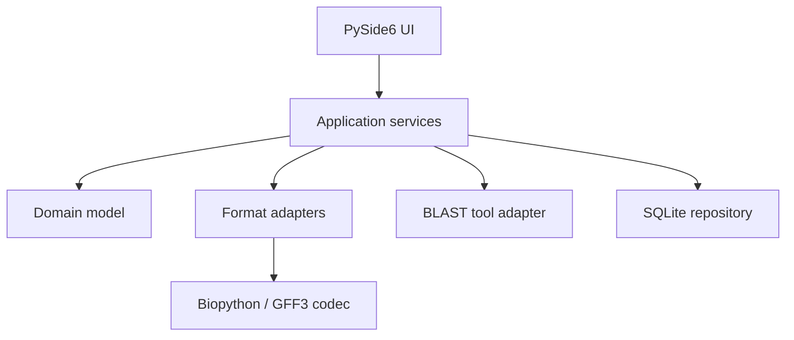
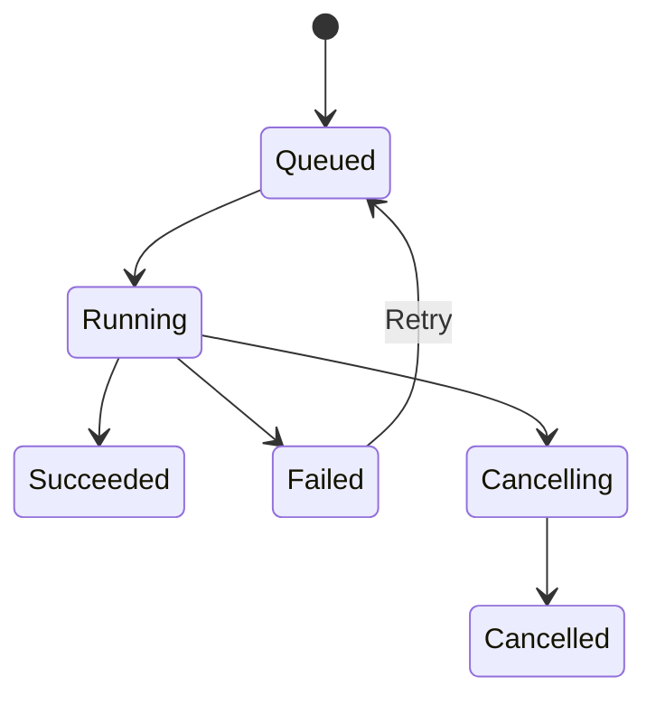
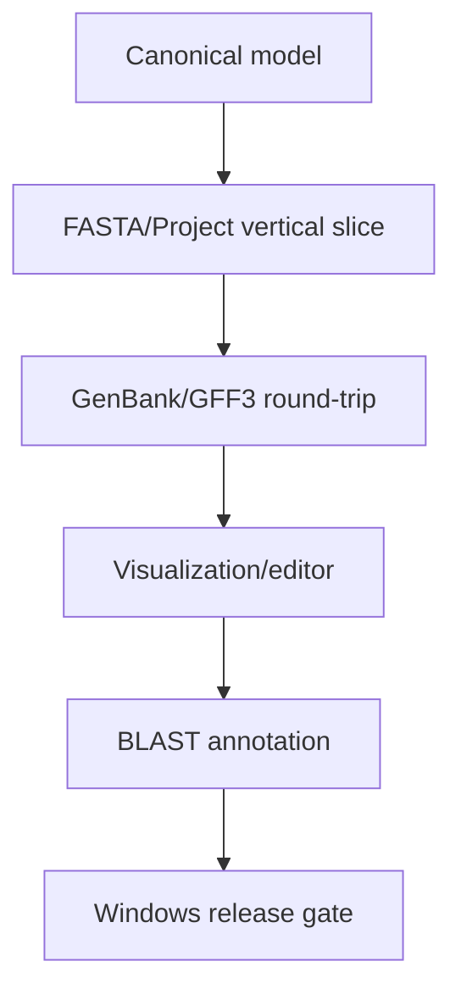

# DNAvigator

## Claude Code 자율 개발 지시서 및 상세 작업계획서

- 문서 버전: 1.0
- 작성 기준일: 2026-08-26
- 작업명: Windows 기반 로컬 genome sequence visualization 및 annotation workbench 개발
- 임시 제품명: **DNAvigator**
- 최종 목표: FASTA/GenBank/GFF3 계열 파일을 열어 genome과 annotation을 시각화·편집하고, 선택 구간을 수동 또는 로컬 BLAST 근거로 annotation한 뒤 표준 파일로 내보낼 수 있는 독립 실행형 Windows 프로그램

---

# 0. Claude에게 내리는 최상위 실행 지시

당신은 이 프로젝트의 수석 소프트웨어 아키텍트이자 구현 책임자다. 이 문서는 아이디어 검토용 문서가 아니라 **실제로 작동하는 프로그램을 완성하기 위한 구현 명세**다. 계획이나 목업만 작성하고 멈추지 말고, 저장소 생성부터 코드 구현, 테스트, Windows 빌드, 사용자 문서 작성까지 계속 수행하라.

다음 원칙은 나머지 모든 세부 요구사항보다 우선한다.

1. 이 문서에서 기본값이 정해진 사항에 관해서는 사용자에게 다시 선택을 요구하지 않는다.
2. 인증정보, 외부 계정 권한, 코드서명 인증서처럼 실제로 제공받지 않으면 해결할 수 없는 문제가 아니라면 질문하지 말고 합리적인 기본값으로 진행한다.
3. 먼저 거대한 UI 목업을 만든 뒤 내부 기능을 비워두지 않는다. **파일 하나를 열고, 보고, annotation을 만들고, 저장하고, 다시 열어 검증하는 수직 기능 단위**를 가장 먼저 완성한다.
4. 화면에 활성화된 버튼과 메뉴는 실제로 작동해야 한다. 미구현 기능은 숨기거나 명시적으로 비활성화하고, 작동하는 것처럼 보이는 placeholder를 두지 않는다.
5. 테스트 실패를 회피하기 위해 테스트를 삭제하거나 느슨하게 만들지 않는다. 실패 원인을 수정한다.
6. 좌표, strand, circular origin, joined location, CDS phase처럼 생물정보학적으로 중요한 정보를 편의상 버리지 않는다.
7. 원본 파일을 자동으로 덮어쓰지 않는다. 편집 내용은 project에 저장하고, export는 사용자가 지정한 새 경로에 원자적으로 기록한다.
8. 사용자의 sequence나 annotation을 외부 서버로 전송하지 않는다. 기본 동작은 완전한 local/offline 처리다.
9. Geneious, CLC Genomics Workbench 또는 다른 상용 프로그램의 소스, 아이콘, 화면 자산, 상표, 고유 UI를 복제하지 않는다. 일반적인 genome browser 작업 흐름만 독립적으로 구현한다.
10. 구현 진행상황을 `PROGRESS.md`, 설계 판단을 `docs/DECISIONS.md`, 알려진 제한을 `docs/KNOWN_LIMITATIONS.md`에 계속 기록한다.
11. Git 저장소가 있다면 작고 검증 가능한 단위로 로컬 commit을 남긴다. 사용자의 명시적 권한과 인증정보가 없으면 외부 저장소에 push하거나 release를 공개하지 않는다.
12. 각 milestone이 끝날 때마다 formatter, lint, type check, unit test, integration test를 실행하고 통과시킨 뒤 다음 단계로 이동한다.
13. 개발 환경이 Windows가 아니면 Windows executable을 교차 빌드했다고 가장하지 않는다. Windows GitHub Actions workflow 또는 실제 Windows runner를 마련하여 빌드와 smoke test를 수행한다.
14. P0 acceptance criteria가 모두 통과하기 전에는 “완성”이라고 보고하지 않는다.

## 0.1 최초 실행 순서

작업을 시작하면 다음을 순서대로 수행하라.

1. 현재 디렉터리와 Git 상태, 사용 가능한 Python, 운영체제, 빌드 도구를 점검한다.
2. 기존 파일이 있으면 무단으로 덮어쓰지 말고 구조를 파악한다. 빈 디렉터리라면 아래 명세대로 새 프로젝트를 초기화한다.
3. 이 문서를 `docs/PRODUCT_SPEC.md`로 복사해 저장하고 최상위 요구사항으로 취급한다.
4. `PROGRESS.md`에 milestone checklist를 만든다.
5. 최소 애플리케이션 skeleton과 테스트 환경을 구축한다.
6. Phase 1의 수직 기능부터 구현한다.
7. 각 phase의 gate를 통과할 때까지 구현–테스트–수정 루프를 반복한다.
8. 최종적으로 설치형과 portable 형태의 Windows x64 산출물, 테스트 보고서, 사용자 매뉴얼을 만든다.

---

# 1. 제품 정의

## 1.1 해결하려는 문제

연구자가 bacterial genome assembly, plasmid, phage genome 또는 기타 DNA/protein sequence를 확인하고 annotation을 수정하기 위해 매번 고가의 범용 상용 프로그램을 구독하지 않아도 되게 한다. 사용자는 코드를 몰라도 Windows에서 프로그램을 실행하여 다음 작업을 수행할 수 있어야 한다.

1. FASTA, GenBank, GFF3 및 파생 FASTA 파일을 연다.
2. 여러 contig 또는 여러 record의 구조와 annotation을 본다.
3. genome을 확대·축소하면서 feature 위치, 방향, qualifier, translation을 확인한다.
4. 원하는 염기 구간을 선택하여 수동 annotation을 추가한다.
5. 로컬 sequence database를 만들거나 이미 존재하는 BLAST database를 등록한다.
6. 선택 구간, feature 또는 전체 record를 BLAST 검색한다.
7. BLAST hit와 alignment 근거를 확인한 뒤 annotation 후보를 적용한다.
8. 기존 annotation을 수정·삭제·복제하고 undo/redo 한다.
9. 편집 결과를 project로 저장하고 GenBank, GFF3+FASTA, FASTA, FAA, FFN 등 표준 형식으로 내보낸다.
10. 내보낸 파일을 다시 열었을 때 sequence, feature 위치, strand, qualifier가 의미상 동일한지 검증한다.

## 1.2 이 제품의 정확한 범위

첫 번째 안정 릴리스는 **assembled sequence 및 annotation workbench**다. “WGS 프로그램”이라는 표현을 raw read 분석 전체로 확대 해석하지 않는다.

### P0: 첫 안정 릴리스에 반드시 포함

- Windows 10/11 x64 desktop application
- Python이 설치되지 않은 PC에서 실행 가능한 배포본
- multi-record FASTA/GenBank/GFF3 import
- DNA/RNA/protein record 구분
- contig/project tree
- linear genome map, circular genome map, base-level sequence view
- annotation 목록, 필터, 검색, 상세 qualifier inspector
- manual feature creation/edit/delete
- compound/joined feature와 reverse strand 처리
- circular origin을 가로지르는 feature 처리
- project save/open, autosave, crash recovery
- undo/redo
- local NCBI BLAST+ 탐지·등록
- custom nucleotide/protein BLAST database 생성·검증·관리
- blastn, blastp, blastx, tblastn 실행
- BLAST 결과 표, HSP alignment, feature 생성 후보 미리보기
- 사용자의 명시적 확인 후 BLAST 근거 annotation 적용
- GenBank, GFF3+FASTA, nucleotide FASTA, protein FASTA, CDS nucleotide FASTA export
- export 전 validation과 export 후 재수입 semantic validation
- 한국어 Windows 경로, 공백 포함 경로, 긴 파일명 처리
- 사용자 매뉴얼, 개발자 문서, 테스트, Windows build workflow

### P1: P0 안정화 직후 구현하되 구조는 처음부터 고려

- 여러 feature에 대한 batch BLAST 및 batch annotation review queue
- 제한적 sequence base editing과 좌표 재배치 preview
- feature table CSV/TSV import/export
- SVG/PNG/PDF map export
- 사용자가 정의하는 feature color rules
- translation frame view와 ORF candidate 탐색
- motif/regex/ambiguous nucleotide search
- annotated GenBank에서 BLAST database와 annotation metadata를 함께 추출
- existing BLAST database 등록 및 integrity check
- 선택한 feature 집합의 FAA/FFN export
- bilingual UI 문자열 구조와 한국어/영어 전환

### P2 이후의 확장 모듈이며 P0를 방해해서는 안 됨

- FASTQ QC, raw read trimming
- BAM/CRAM read alignment 및 coverage track
- VCF variant visualization/calling
- de novo assembly
- multi-genome whole-genome alignment
- synteny/comparative genomics
- phylogenetic tree
- chromatogram editing
- primer design
- remote NCBI BLAST
- Bakta/Prokka/AMRFinderPlus/ABRicate 연동
- cloud collaboration 또는 중앙 서버

P2 메뉴를 미리 만들어 비어 있게 두지 않는다. 확장 가능한 adapter/interface만 설계한다.

## 1.3 비목표

- 상용 제품의 모든 기능을 한 번에 재현하지 않는다.
- 임상 진단 결과를 자동 판정하지 않는다.
- BLAST hit 하나만으로 유전자 기능을 확정하거나 사용자의 확인 없이 annotation을 덮어쓰지 않는다.
- 원본 GenBank 파일의 공백, 줄바꿈, LOCUS line 형식을 byte-for-byte 복제한다고 약속하지 않는다. 대신 생물학적 의미의 round-trip 보존을 보장한다.
- 첫 릴리스에서 수백 Gb 규모의 read dataset을 메모리에 올려 처리하지 않는다.

## 1.4 주요 대상 데이터

- 세균 chromosome 및 plasmid
- bacteriophage genome
- 여러 contig로 이루어진 short/long-read assembly
- 통상 1 kb–20 Mb record, 1–20,000 feature
- 한 project 내 수십–수백 record
- 단백질 FASTA collection

100 Mb 이상의 eukaryotic chromosome도 열 수 있는 구조를 지향하되, P0 성능 보증 대상은 bacterial-scale genome이다.

---

# 2. 핵심 사용자 시나리오와 완료 조건

## 2.1 시나리오 A: annotation 없는 assembly에 수동 feature 추가

1. 사용자가 `assembly.fasta`를 연다.
2. multi-FASTA record가 왼쪽 project tree에 각각 나타난다.
3. contig 하나를 선택하면 길이, GC%, topology, description이 표시된다.
4. 사용자가 1-based 좌표 `101..900`, `+` strand를 입력하거나 sequence view에서 drag한다.
5. feature type `CDS`, gene `exampleA`, product `example protein`을 지정한다.
6. genetic code 11로 translation preview를 확인한다.
7. feature를 저장하고 map에서 화살표로 확인한다.
8. project를 닫았다가 다시 열어도 feature가 유지된다.
9. GenBank로 export한 뒤 다시 import하면 sequence, location, strand, type, qualifier가 동일하다.

**Acceptance:** 위 흐름이 오류 없이 끝나고 undo/redo도 동작한다.

## 2.2 시나리오 B: annotated GenBank 검토 및 수정

1. 사용자가 여러 record가 포함된 `.gbk` 또는 `.gbff`를 연다.
2. source, gene, CDS, tRNA, rRNA, repeat_region 등 기존 feature가 표시된다.
3. feature를 클릭하면 nucleotide sequence, translated protein, location parts, strand, qualifiers가 보인다.
4. `/product`, `/note`, `/gene`, `/locus_tag`, `/db_xref`, `/inference`를 수정한다.
5. feature 시작/끝 좌표를 바꾸면 validation 경고와 translation 변화가 미리 표시된다.
6. 수정된 record를 `.gbk` 및 `.gff3`로 export한다.

**Acceptance:** 알려지지 않은 qualifier도 유실되지 않고, multi-value qualifier 순서와 값이 보존된다.

## 2.3 시나리오 C: custom BLAST database 기반 annotation

1. 사용자가 nucleotide 또는 protein FASTA/annotated GenBank를 database source로 지정한다.
2. 프로그램이 sequence ID 중복과 허용되지 않는 ID를 검사하고, 필요한 경우 내부 safe ID와 원래 ID의 mapping을 만든다.
3. `makeblastdb`를 background job으로 실행하고 완료 후 `blastdbcmd -info`로 검증한다.
4. 사용자가 genome 구간 또는 CDS feature를 선택한다.
5. query와 database molecule type에 맞는 BLAST program을 자동 제안한다.
6. 사용자는 program, e-value, max target sequences, identity/coverage filter, thread 수를 조정할 수 있다.
7. 결과에는 subject ID/title, identity, query coverage, subject coverage, e-value, bit score, coordinates, strand/frame이 보인다.
8. hit를 선택하면 gapped alignment가 보인다.
9. “annotation 후보 만들기”를 누르면 적용될 좌표와 qualifiers, provenance가 미리 표시된다.
10. 사용자가 확인해야만 annotation이 생성 또는 갱신된다.

**Acceptance:** DB나 BLAST 실행파일이 없을 때 프로그램이 멈추거나 crash하지 않고, 설정 방법과 정확한 문제를 안내한다.

## 2.4 시나리오 D: circular genome의 origin-spanning feature

1. circular record의 마지막 300 bp와 처음 500 bp에 걸친 CDS를 import한다.
2. linear view에서는 두 segment가 동일 feature로 연결되어 보이고, circular view에서는 하나의 연속 feature로 보인다.
3. reverse strand와 join 순서가 유지된다.
4. GenBank에서는 compound location으로, GFF3에서는 규격에 맞는 circular representation으로 export된다.

**Acceptance:** export–reimport 후 동일한 추출 nucleotide와 translation을 얻는다.

## 2.5 시나리오 E: protein FASTA

1. `.faa` 파일을 열면 각 record가 protein으로 인식된다.
2. amino-acid sequence view와 protein feature가 표시된다.
3. protein DB를 대상으로 blastp를 실행할 수 있다.
4. protein FASTA로 다시 export할 수 있다.

**Acceptance:** protein sequence에 nucleotide 전용 기능을 실행하려 하면 비활성화되거나 명확한 설명이 나온다.

---

# 3. 기술 스택과 구현 원칙

## 3.1 기본 스택

| 영역 | 기본 선택 | 이유 및 제약 |
|---|---|---|
| 언어 | Python 3.12 계열 | Windows 지원과 생물정보학 생태계의 안정성을 우선한다. 실제 구현 시 상호 호환되는 최신 patch 버전을 lock한다. |
| Desktop UI | PySide6 / Qt 6 | native desktop UX, 고해상도, model/view, background job, drawing API, Windows packaging에 적합하다. |
| Sequence/GenBank | Biopython `SeqIO`, `SeqRecord`, `SeqFeature` | 성숙한 FASTA/GenBank parser/writer를 adapter 뒤에서 활용한다. domain model이 Biopython 객체에 직접 종속되지는 않게 한다. |
| GFF3 | 독립 adapter | Sequence Ontology GFF3 명세에 맞춘 parser/writer를 구현한다. 유지상태와 license를 검토한 뒤 적절한 라이브러리를 보조적으로 사용할 수 있으나 round-trip 규칙은 자체 테스트로 보장한다. |
| Project DB | Python 표준 `sqlite3` | 단일 파일 project, transaction, migration, 검색, 복구가 쉽다. |
| BLAST | NCBI BLAST+ command-line executable | `makeblastdb`, `blastdbcmd`, `blastn`, `blastp`, `blastx`, `tblastn`을 subprocess adapter로 호출한다. |
| Test | pytest, pytest-qt, Hypothesis | 좌표 변환과 format round-trip에는 property-based test를 사용한다. |
| 품질 | Ruff, mypy 또는 pyright | formatter/lint/type check를 CI gate로 둔다. |
| Packaging | PyInstaller one-folder 우선 | Qt DLL을 분리한 onedir build를 우선해 시작 속도, 진단, LGPL 대응을 단순화한다. |
| Installer | Inno Setup 또는 동등한 Windows installer | 시작 메뉴, uninstall, file association을 제공한다. portable ZIP도 함께 만든다. |
| CI | GitHub Actions `windows-latest` | Windows build, test, packaging smoke test를 자동화한다. |

## 3.2 dependency 정책

1. 모든 runtime/dev dependency는 `pyproject.toml`에 선언한다.
2. 재현 가능한 lock file을 commit한다. `uv.lock`을 사용할 수 있으나 실행 환경에 uv가 없을 경우 표준 venv/pip bootstrap 경로도 문서화한다.
3. dependency를 추가하기 전에 다음을 확인한다.
   - active maintenance 여부
   - Windows wheel 제공 여부
   - license와 재배포 조건
   - PyInstaller 호환성
   - 해당 기능을 표준 라이브러리로 안전하게 구현할 수 있는지
4. GPL 의존성을 무심코 library로 결합하지 않는다. 외부 executable로 호출하는 도구와 Python library dependency를 구분한다.
5. PySide6 community edition은 LGPLv3/GPLv3 및 commercial 조건을 가지므로 배포 정책을 `docs/LICENSING.md`에 명시한다. Qt를 동적 라이브러리 형태로 유지하고 Third-Party Notices를 포함한다.
6. BLAST+ binary는 재배포 허용 여부를 추정하지 않는다. 법적 검토 전 기본 배포본에는 자동으로 포함하지 말고 다음 두 경로를 제공한다.
   - 사용자가 기존 NCBI BLAST+ 설치 경로를 선택
   - 프로그램의 Tool Setup Wizard가 공식 NCBI 배포 위치에서 compatible Windows package를 내려받고 checksum을 검증해 user-local tools directory에 설치
7. 네트워크를 사용할 수 없는 환경을 위해 offline ZIP 선택 설치 경로도 제공한다.

## 3.3 코딩 원칙

- UI code 안에 parsing, coordinate conversion, BLAST command construction을 넣지 않는다.
- domain layer는 Qt와 Biopython을 직접 import하지 않는다.
- 모든 파일 경로는 `pathlib.Path`로 처리한다.
- subprocess는 shell string이 아니라 argument list로 실행한다.
- Korean/Unicode path와 공백을 포함한 경로를 test fixture에서 검증한다.
- 긴 작업은 UI thread에서 실행하지 않는다.
- mutation은 command object와 transaction을 통해 처리한다.
- enabled UI action은 반드시 실제 service method와 연결한다.
- 예외를 광범위하게 삼키지 않는다. 사용자용 메시지와 상세 log를 분리한다.
- sequence 및 annotation 변경은 provenance와 audit event를 남긴다.
- format adapter는 import warning과 validation issue를 structured object로 반환한다.

## 3.4 진단 및 자동 검증용 command-line entry point

GUI 프로그램이더라도 clean-machine CI와 장애 진단을 위해 다음 option을 제공한다. 일반 사용자는 command line을 몰라도 되며, 동일한 application service를 호출하므로 별도 구현으로 기능이 갈라지지 않게 한다.

- `DNAvigator.exe --version`
- `DNAvigator.exe --diagnostics`
- `DNAvigator.exe --self-test`
- `DNAvigator.exe --smoke-test <fixture-directory> <output-directory>`

`--self-test`는 UI를 띄우지 않고 runtime resource, writable user directory, SQLite, format codecs, Qt plugin, 설정된 BLAST executable을 검사하여 exit code와 JSON/텍스트 결과를 반환한다. BLAST가 아직 설정되지 않은 상태는 core self-test 실패가 아니라 `optional_tool_unavailable`로 구분한다.

`--smoke-test`는 합성 fixture를 import하고 project 저장–재열기–annotation 생성–GenBank export–reimport semantic comparison까지 수행한다. test 전용 가짜 구현이 아니라 GUI가 사용하는 동일 service layer를 사용한다.

---

# 4. 전체 아키텍처



## 4.1 layer 책임

### Domain

- sequence record, feature, compound location, qualifier, project, BLAST evidence의 canonical model
- 0-based half-open coordinate invariant
- sequence slicing, reverse-complement, translation
- validation rule
- UI나 file format과 무관한 business rule

### Application services

- import/export orchestration
- project transaction
- feature command 및 undo/redo payload
- BLAST job 생성과 결과 적용
- autosave/recovery
- batch operation
- 사용자 설정

### Infrastructure/adapters

- FASTA/GenBank/GFF3 reader/writer
- SQLite repository와 schema migration
- NCBI BLAST+ executable detector/runner
- filesystem, checksum, atomic write
- logging

### UI

- project explorer
- genome canvases
- sequence selection
- feature inspector/editor
- BLAST manager/results
- job panel
- validation dialog
- settings/tool setup

## 4.2 권장 저장소 구조

```text
DNAvigator/
  pyproject.toml
  uv.lock 또는 requirements.lock
  README.md
  CHANGELOG.md
  PROGRESS.md
  LICENSE
  THIRD_PARTY_NOTICES.md
  src/
    genome_workbench/
      __init__.py
      __main__.py
      app.py
      version.py
      domain/
        models.py
        coordinates.py
        locations.py
        qualifiers.py
        sequence_ops.py
        validation.py
        events.py
      application/
        project_service.py
        import_service.py
        export_service.py
        annotation_service.py
        blast_service.py
        job_service.py
        recovery_service.py
        settings_service.py
      infrastructure/
        persistence/
          sqlite_repository.py
          schema.py
          migrations/
        formats/
          fasta_adapter.py
          genbank_adapter.py
          gff3_adapter.py
          format_sniffer.py
          semantic_compare.py
        blast/
          detector.py
          command_builder.py
          runner.py
          parser.py
          database_manager.py
          metadata.py
        filesystem/
          atomic_write.py
          checksums.py
          paths.py
        logging_setup.py
      ui/
        main_window.py
        actions.py
        models/
        dialogs/
        docks/
        views/
          linear_genome_view.py
          circular_genome_view.py
          sequence_view.py
          feature_table_view.py
          blast_alignment_view.py
        widgets/
        resources/
        i18n/
  tests/
    unit/
    integration/
    ui/
    packaging/
    fixtures/
  scripts/
    bootstrap_dev.ps1
    run_checks.ps1
    build_windows.ps1
    make_release.ps1
  installer/
    dnavigator.iss
  docs/
    PRODUCT_SPEC.md
    ARCHITECTURE.md
    DATA_MODEL.md
    FORMAT_SUPPORT.md
    BLAST_SETUP.md
    USER_GUIDE_KO.md
    TEST_PLAN.md
    DECISIONS.md
    KNOWN_LIMITATIONS.md
    LICENSING.md
  .github/
    workflows/
      test.yml
      windows-release.yml
```

## 4.3 plugin 가능 경계

처음부터 범용 plugin framework를 만들지는 않는다. 대신 다음 Python protocol/interface를 명확히 분리한다.

- `SequenceFormatReader`
- `SequenceFormatWriter`
- `AnalysisToolAdapter`
- `AnnotationProvider`
- `TrackProvider`
- `ProjectRepository`

P2 도구는 이 경계를 통해 추가할 수 있어야 한다.

---
# 5. Canonical data model과 좌표 규칙

좌표 오류는 이 프로그램에서 가장 위험한 결함이다. 모든 format adapter와 UI는 하나의 내부 좌표 체계로 변환한 뒤 사용한다.

## 5.1 좌표 불변조건

1. 내부 좌표는 항상 **0-based, end-exclusive**다.
   - UI의 `101..900`은 내부 `[100, 900)`이다.
   - 길이는 항상 `end0 - start0`이다.
2. UI, GenBank, GFF3에 표시할 때는 명시적으로 1-based inclusive로 변환한다.
3. `strand`는 `+1`, `-1`, `0/None` 중 하나다.
4. reverse-strand feature도 내부 segment의 `start0 < end0`를 유지한다. 방향은 strand로 표현한다.
5. compound feature는 하나 이상의 ordered `LocationPart`로 구성한다.
6. circular origin을 넘는 feature는 start가 end보다 큰 단일 pseudo-range로 저장하지 말고, origin을 기준으로 나뉜 ordered parts로 저장한다.
7. UI에서 사용자가 입력한 좌표 체계를 항상 화면에 표시한다. “1-based inclusive”라는 도움말을 숨기지 않는다.
8. CDS translation은 biological 5′→3′ 순서의 ordered parts를 합친 뒤 strand를 적용하고 phase/codon_start를 고려한다.

## 5.2 핵심 entity

### Project

| field | 설명 |
|---|---|
| `id` | UUID |
| `name` | 사용자 표시 이름 |
| `schema_version` | project DB migration version |
| `created_at`, `modified_at` | UTC ISO timestamp |
| `app_version` | 마지막 저장 애플리케이션 버전 |
| `settings_json` | project 단위 표시/분석 설정 |
| `source_manifest` | import source path, checksum, format, imported_at |

### SequenceRecord

| field | 설명 |
|---|---|
| `id` | 내부 UUID, 표시 ID와 분리 |
| `display_id` | FASTA/GenBank record ID |
| `name` | record name |
| `description` | 원래 description |
| `molecule_type` | DNA, RNA, protein, unknown |
| `topology` | linear, circular, unknown |
| `sequence` | canonical uppercase sequence. 필요 시 원래 case 정보를 별도 보존 |
| `length` | 계산값 |
| `checksum_sha256` | canonical sequence checksum |
| `annotations_json` | organism, taxonomy, references, accessions, date, comments 등 record metadata |
| `source_format` | fasta, genbank, gff3 등 |
| `source_record_index` | multi-record 파일 내 순서 |
| `revision` | cache invalidation 및 optimistic update용 정수 |

### Feature

| field | 설명 |
|---|---|
| `id` | 내부 UUID |
| `record_id` | 소속 sequence record |
| `type` | CDS, gene, tRNA, rRNA, source, misc_feature 등 |
| `strand` | +1, -1, 0/None |
| `location_operator` | simple, join, order |
| `parts` | ordered `LocationPart[]` |
| `qualifiers` | key → ordered list of string values |
| `display_label` | rule로 계산하거나 사용자가 override |
| `parent_ids`, `child_ids` | GFF3 관계를 보존 |
| `source` | GenBank source 또는 GFF3 column 2 |
| `score`, `phase` | GFF3 의미 보존 |
| `fuzzy_start`, `fuzzy_end` | before/after/within/unknown position 표현 |
| `provenance_id` | 수동/BLAST/import 근거 |
| `created_at`, `modified_at` | audit timestamp |
| `revision` | undo/cache invalidation용 |

### LocationPart

- `start0`
- `end0`
- `strand_override`가 꼭 필요한 format에 한해 optional
- `phase` optional
- `fuzzy_start`, `fuzzy_end`
- `order_index`

### Provenance / Evidence

| field | 설명 |
|---|---|
| `kind` | import, manual, blast, sequence_edit, batch_rule |
| `tool_name`, `tool_version` | 예: blastp 2.x |
| `database_id`, `database_checksum` | 사용 DB 재현성 |
| `query_checksum` | 당시 query sequence |
| `parameters_json` | 전체 실행 parameter |
| `subject_id` | 적용 hit |
| `identity`, `query_coverage`, `subject_coverage` | 정량 근거 |
| `evalue`, `bitscore` | 정량 근거 |
| `raw_result_ref` | project 내 raw result artifact |
| `created_at` | UTC timestamp |
| `user_note` | 선택적 메모 |

### BLAST entities

- `BlastInstallation`: path, version, detected executables, checksum/source
- `BlastDatabase`: UUID, name, molecule_type, path, source_manifest, checksum, created_at, validated_at, metadata map
- `BlastJob`: status, program, query source/range, parameters, stdout/stderr refs, start/end time, exit code
- `BlastHit`: subject summary
- `BlastHsp`: query/subject coordinates, aligned strings, frame, score metrics

## 5.3 qualifier 보존 규칙

1. qualifier 값은 단일 string으로 축약하지 않고 항상 ordered list로 보존한다.
2. 알 수 없는 qualifier를 삭제하지 않는다.
3. 값이 없는 flag qualifier도 표현할 수 있어야 한다.
4. UI는 자주 쓰는 qualifier를 form field로 제공하되 “전체 qualifiers” key/value editor를 함께 제공한다.
5. key 이름은 원본 표준을 유지하고 export adapter가 필요한 escaping만 수행한다.
6. `/translation`은 CDS location과 sequence로 재계산한 값과 비교한다. 불일치 시 사용자가 선택할 수 있게 한다.
7. `/codon_start`와 GFF3 phase는 동일 개념으로 단순 치환하지 말고 adapter에서 명시적으로 변환한다.

## 5.4 schema migration

- SQLite `PRAGMA user_version` 또는 별도 migration table을 사용한다.
- migration은 forward-only로 version control한다.
- project open 전에 backup을 만든 뒤 transaction 안에서 migration한다.
- 새 app version에서 저장한 project를 구버전이 열 수 없는 경우 읽기 전용 또는 명확한 오류를 제공한다.
- 테스트에서 최소 두 세대의 migration을 검증한다.

---

# 6. 파일 형식 지원 명세

## 6.1 format detection

확장자만 믿지 않는다. 확장자, magic bytes, 첫 유효 line, parser probe를 함께 사용한다.

- UTF-8 BOM, CRLF/LF를 처리한다.
- gzip magic을 인식하고 `.gz` 압축을 지원한다.
- 확장자가 잘못되어도 내용이 명확하면 열되 경고한다.
- 여러 parser가 가능한 애매한 입력은 import preview에서 후보를 보여준다.
- binary 또는 손상 파일은 hex dump를 노출하지 말고 안전한 오류를 보여준다.

## 6.2 입력 형식

| 형식 | 확장자 | P0 동작 |
|---|---|---|
| Nucleotide FASTA | `.fasta`, `.fa`, `.fna`, `.ffn`, `.fnn`, `.fas`, `.fsa`, `.nt` 및 `.gz` | multi-record streaming import. `.fnn`은 비표준 alias일 수 있으나 사용자가 요청했으므로 content sniff 후 nucleotide FASTA로 허용한다. |
| Protein FASTA | `.faa`, `.pep`, `.protein.fasta` 및 `.gz` | protein record로 import. nucleotide 전용 도구는 비활성화한다. |
| Generic FASTA | 확장자 무관 | sequence alphabet으로 DNA/RNA/protein을 추정하고 import preview에서 수정 가능하게 한다. |
| GenBank | `.gb`, `.gbk`, `.genbank`, `.gbff` 및 `.gz` | multi-record, record annotations, references, features, compound/fuzzy location, qualifiers import |
| GFF3 | `.gff`, `.gff3` 및 `.gz` | 9 columns, directives, comments, attributes, Parent/ID, multi-part features, embedded `##FASTA` import |
| GFF3 + separate FASTA | 두 파일 | seqid matching preview 후 결합. 누락/중복 seqid를 보고한다. |
| CDS nucleotide FASTA | `.ffn`, `.fna` | standalone nucleotide collection으로 열 수 있고, 사용자가 parent record와 mapping할 경우 feature-derived collection으로 연결 가능 |
| Protein annotations | `.faa` | standalone 또는 annotated GenBank에서 추출한 metadata manifest와 결합 가능 |

GTF, EMBL, BED는 P1/P2 adapter 후보이며 P0에서 지원한다고 표시하지 않는다.

## 6.3 FASTA import 세부 규칙

- header의 첫 token을 record ID로, 나머지를 description으로 제안하되 원문 header도 metadata로 보존한다.
- 중복 ID가 있으면 내부 UUID로는 모두 보존하되 export/BLAST DB 생성 전에 해결 wizard를 제공한다.
- 허용 alphabet, whitespace, gap, stop symbol을 검사한다.
- nucleotide에서 IUPAC ambiguous symbols를 허용한다.
- protein에서 표준 amino acid와 `X`, `B`, `Z`, `J`, `U`, `O`, `*`, gap 정책을 명시한다.
- invalid symbol 위치와 개수를 보고하고, 사용자가 취소·replace with N/X·그대로 import 중 선택할 수 있게 한다.
- 0-length record는 기본적으로 error다.

## 6.4 GenBank import/export 세부 규칙

### Import

- Biopython parser warning을 수집해 import report에 포함한다.
- `LOCUS`, `DEFINITION`, `ACCESSION`, `VERSION`, `KEYWORDS`, `SOURCE`, `ORGANISM`, taxonomy, references, comments를 canonical metadata에 매핑한다.
- `source` feature를 일반 feature와 구분하지 않고 보존한다.
- `join`, `complement`, nested compound location, fuzzy position을 domain location으로 변환한다.
- malformed feature가 전체 record import를 막지 않도록 strict/lenient mode를 제공한다. 기본은 lenient import + 명확한 issue report다.

### Export

- `molecule_type` 등 writer가 요구하는 metadata를 export validator에서 확인한다.
- record ID와 LOCUS 제한을 검사하고 자동 변경 전에 preview를 제공한다.
- compound location, strand, qualifier list를 보존한다.
- CDS translation을 재계산하고 기존 `/translation`과 차이를 보고한다.
- export는 temporary file에 쓴 뒤 fsync/close, 재수입 validation 후 destination으로 atomic replace한다.
- byte-identical round-trip이 아니라 semantic round-trip을 검증한다.

## 6.5 GFF3 import/export 세부 규칙

- 좌표는 GFF3의 1-based positive start/end를 내부 0-based half-open으로 변환한다.
- `type`은 Sequence Ontology term 또는 SO accession을 허용한다.
- strand `+`, `-`, `.`, `?`를 보존한다.
- CDS phase `0`, `1`, `2`를 필수 규칙에 맞게 검증한다.
- URL percent escaping과 multi-value attribute를 올바르게 처리한다.
- `ID`, `Name`, `Alias`, `Parent`, `Dbxref`, `Ontology_term`, `Target`, `Gap`, `Derives_from`, `Note`, `Is_circular`를 보존한다.
- 동일 ID를 가진 multi-line discontinuous feature를 하나의 feature 또는 관계 있는 parts로 복원한다.
- Parent graph cycle을 validation error로 보고한다.
- `##sequence-region`, `##species`, `##genome-build`, comments와 알 수 없는 directive를 가능한 한 보존한다.
- embedded FASTA가 있으면 feature seqid와 sequence record를 연결한다.
- `.gff` 확장자이지만 `##gff-version 3`이 없거나 GFF2/GTF로 판단되는 파일은 GFF3로 조용히 오해석하지 않는다. 지원되지 않는 형식을 명시하고 변환 또는 향후 adapter를 안내한다.
- separate FASTA를 선택할 때 exact seqid, trimmed token, alias mapping을 순서대로 시도하되 추정 mapping은 확인받는다.
- circular origin representation을 규격에 맞게 처리하고 export–reimport sequence extraction으로 검증한다.

## 6.6 출력 형식

| 출력 | 옵션 |
|---|---|
| GenBank | single/multi-record `.gbk`/`.gbff`; 전체 project 또는 선택 record |
| GFF3 | annotation only, embedded FASTA, separate FASTA |
| Nucleotide FASTA | 전체 record, 선택 record, 선택 구간 |
| Protein FASTA | protein records 또는 CDS translation; header template 설정 |
| FFN | CDS nucleotide sequence; strand와 compound location을 적용한 biological sequence |
| Feature table TSV/CSV | record ID, feature ID, type, coordinates, strand, qualifiers, provenance summary |
| Map image | P1: SVG 우선, PNG/PDF 선택 |

Protein-only record를 nucleotide GenBank로 내보내지 않는다. P0에서는 FAA를 사용하고, GenPept 지원은 별도 adapter가 구현·검증될 때만 노출한다. Sequence가 없는 annotation-only GFF3도 FASTA와 결합되기 전에는 GenBank export를 허용하지 않는다.

## 6.7 semantic round-trip 비교

export 후 임시로 다시 import하여 다음을 비교한다.

- record 수와 순서
- sequence checksum
- molecule type 및 topology
- feature 수
- feature type
- normalized location parts와 strand
- qualifier key와 ordered values
- parent/child relationship
- CDS 추출 nucleotide checksum
- CDS translation checksum

format 특성상 보존할 수 없는 metadata는 export 전에 `warning`으로 구체적으로 알려주고 `docs/FORMAT_SUPPORT.md`의 compatibility matrix에 기록한다.

---

# 7. Windows UI/UX 상세 명세

## 7.1 Main Window 배치

### 상단

- Menu: File, Edit, View, Sequence, Annotation, BLAST, Tools, Help
- Toolbar: Open, Save, Undo, Redo, Zoom, Add Feature, Run BLAST, Export
- 현재 record, coordinate, selection length를 표시하는 context bar

### 왼쪽 dock: Project Explorer

- project
  - imported file/source group
  - sequence records/contigs
  - feature sets/tracks
  - BLAST jobs
- record마다 molecule type, length, circular/linear icon, unsaved state 표시
- 검색과 sort: source order, name, length
- multi-select export 지원

### 중앙 tab area

- Overview
- Linear Map
- Circular Map
- Sequence
- Feature Table
- BLAST Result

같은 record의 view는 selection과 zoom context를 공유하되 사용자가 pin할 수 있게 한다.

### 오른쪽 dock: Inspector

- Record metadata 또는 Feature detail
- Coordinates/strand/location parts
- Common qualifiers form
- All qualifiers table
- Nucleotide/protein preview
- Validation issues
- Provenance/evidence
- Apply / Revert

### 하단 dock: Jobs & Log

- running/queued/completed/failed job
- progress, elapsed time, cancel
- user-facing short message
- 상세 log 열기
- log file 경로 copy

## 7.2 Linear genome map

- coordinate ruler와 visible range
- strand별 gene arrow
- feature lane 자동 배치
- 겹치는 feature는 충돌 회피 lane 또는 compact stacking
- type/source/track별 color rule
- label 우선순위: `gene` → `locus_tag` → `product` → feature type
- mouse wheel zoom, Shift+wheel horizontal pan, drag pan
- click feature select, Ctrl+click multi-select
- background drag로 interval select
- double click feature zoom-to-feature
- minimap/overview에서 viewport box 이동
- context menu: inspect, edit, copy nucleotide, copy protein, BLAST, export selection, delete
- origin-spanning feature 연결 표시
- fuzzy boundary 시각표시
- tooltips에 1-based coordinates, type, label, strand, length

## 7.3 Circular genome map

- topology가 circular인 record에서 기본 활성화
- feature ring, forward/reverse strand 분리
- GC content와 GC skew track은 계산 비용이 낮은 범위에서 optional
- zoom/pan 또는 rotation
- origin marker와 coordinate ticks
- origin-spanning feature를 끊기지 않은 arc로 표시
- feature click selection을 linear/sequence view와 동기화
- SVG export 시 text와 vector path 유지

## 7.4 Base-level sequence view

수백만 문자를 `QPlainTextEdit` 하나에 밀어 넣지 말고 virtualized custom view를 구현한다.

- visible rows만 QPainter로 그린다.
- line width를 50/60/80/100 bases 중 선택한다.
- top strand sequence, complement, translation frame을 toggle한다.
- 좌측에 1-based coordinate를 표시한다.
- feature background/highlight track을 sequence 위에 겹친다.
- mouse drag selection, Shift extension, keyboard navigation
- IUPAC symbol에 대한 color scheme
- selected sequence의 length, GC%, reverse complement, translation preview
- Copy Plain, Copy FASTA, Copy Reverse Complement
- search result navigation
- 매우 높은 zoom에서는 base별 caret를 지원하고, sequence edit mode는 명시적으로 진입하게 한다.

## 7.5 Feature table

- Qt model/view 기반 virtualized table
- columns: label, type, start, end, strand, length, gene, locus_tag, product, note, source, evidence
- sort/filter/search
- type, strand, source, provenance, validation status로 filter
- row click과 map selection 동기화
- multiple rows export/delete/edit common qualifier
- 10,000–100,000 rows에서 UI가 멈추지 않게 lazy model을 사용한다.

## 7.6 Inspector/feature editor

### Basic

- feature type autocomplete
- display label
- strand
- simple/join/order location
- 각 location part의 start/end/phase
- coordinate entry에는 `1-based inclusive` 라벨 상시 표시

### Common qualifiers

- gene
- locus_tag
- product
- note
- protein_id
- db_xref
- inference
- experiment
- EC_number
- transl_table
- codon_start
- pseudo/pseudogene

### Advanced

- key/value list editor
- multi-value 추가/순서 변경
- flag qualifier
- parent/child relationship
- raw import metadata view

### Preview

- extracted nucleotide
- reverse-complement 적용 결과
- protein translation
- start/stop codon, length % 3, internal stop warning
- 현재 값과 편집 후 값 diff

## 7.7 UI 상태와 안전성

- unsaved project/tab에 `*` 표시
- app 종료 시 저장/버리기/취소
- destructive action에는 영향 범위를 표시
- delete annotation은 undo 가능하므로 매번 과도한 modal을 띄우지 않되, 대량 삭제는 확인한다.
- import/export/BLAST 중 UI 전체를 잠그지 않는다.
- crash 후 다음 실행 때 recovery project를 제안한다.
- high-DPI scaling과 Windows 125%/150%/200%를 UI test한다.
- dark/light theme를 지원하되 첫 구현의 핵심 기능을 지연시키지 않는다.

---


# 8. 시각화 엔진과 성능 설계

## 8.1 렌더링 원칙

1. zoomed-out genome view에서 base 하나당 UI object를 만들지 않는다.
2. feature 하나마다 무거운 widget을 만들지 않는다.
3. viewport와 겹치는 feature만 interval index로 조회한다.
4. 화면 좌표 변환은 하나의 `ViewportTransform`에서 수행한다.
5. label collision 계산은 visible label에만 적용한다.
6. sequence/feature revision이 바뀌면 관련 tile만 invalidate한다.
7. zoom level에 따라 표현 세부도를 바꾼다.

## 8.2 Level of Detail

| 단계 | 화면당 범위 | 표시 |
|---|---:|---|
| Overview | 수 Mb–전체 genome | feature density, major labels, contig boundaries |
| Gene | 수십–수백 kb | gene arrow, type/color, 주요 label |
| Feature | 수 kb–수십 kb | 모든 feature와 qualifiers tooltip |
| Base | 수십–수백 bp | nucleotide letters, complement, translation, precise selection |

정확한 threshold는 viewport width와 font metrics로 동적으로 계산한다.

## 8.3 권장 구현

- `GenomeCanvas`는 QWidget/QAbstractScrollArea 기반 custom painter로 구현한다.
- `ViewportTransform`은 `genome coordinate ↔ pixel` 변환과 visible interval을 제공한다.
- `FeatureIntervalIndex`는 record별 feature를 조회한다. dependency를 추가하지 않아도 sorted start index + bisect로 bacterial scale을 처리할 수 있다.
- background에서 layout을 계산하되 실제 painting은 UI thread에서 한다.
- expensive GC track 계산은 chunk cache를 사용한다.
- sequence text view는 row index로 visible sequence slice만 읽는다.
- render cache key에는 record UUID, revision, viewport range, zoom bucket, theme, track configuration을 포함한다.

## 8.4 성능 목표

테스트 기준 PC: Windows 11 x64, 8 logical cores 이상, RAM 16 GB, SSD, integrated GPU를 포함한 일반 연구용 PC.

- 5.5 Mb bacterial GenBank, feature 6,000개 import: 목표 5초 이내
- record view 전환: warm cache 500 ms 이내
- pan/zoom: 일반 조작에서 30 fps 이상 또는 input latency 100 ms 이하
- feature table 20,000 rows filter: 1초 이내
- 20 Mb record 메모리 사용: 과도한 복제 없이 합리적 범위 유지
- project save: 변경된 entity만 transaction으로 저장
- 앱 cold start: 배포본 기준 목표 8초 이내

성능 test는 절대시간만으로 flaky하게 만들지 말고 benchmark report와 regression threshold를 분리한다.

---

# 9. Annotation 기능 명세

## 9.1 수동 annotation 생성

사용자는 다음 세 방식으로 feature를 만들 수 있다.

1. sequence/map에서 interval을 선택한 뒤 `Add Feature`
2. 좌표를 직접 입력
3. 기존 feature를 duplicate한 뒤 수정

생성 dialog의 필수/기본값:

- record
- coordinate parts
- strand
- feature type
- location operator
- common qualifiers
- translation table: record 설정 → project 설정 → bacterial default 11 순으로 제안
- provenance: manual

`Apply` 전에 다음을 미리 계산한다.

- 선택 길이
- 추출 sequence
- CDS라면 translation
- frame, start/stop/internal stop
- overlap feature
- circular origin 여부
- validation issues

## 9.2 feature 편집

- 좌표/strand/type/qualifier를 한 transaction으로 수정한다.
- drag handle로 경계를 조정할 수 있으나 precise coordinate editor를 항상 제공한다.
- 여러 feature를 선택해 common qualifier를 batch 추가/교체/삭제할 수 있다.
- parent를 삭제할 때 child 처리 정책을 preview한다.
- `gene`–`CDS` 관계를 자동 제안할 수 있지만 임의로 재구성하지 않는다.
- feature 삭제, 생성, 수정은 모두 `QUndoCommand` 또는 domain command를 통해 undo/redo한다.
- undo stack은 project session 동안 유지하고 autosave와 충돌하지 않게 한다.

## 9.3 annotation validation

### Error

- record 범위를 벗어난 coordinate
- start/end 관계 오류
- 존재하지 않는 parent
- parent graph cycle
- GFF3 CDS인데 phase가 유효하지 않음
- sequence가 없는데 sequence-dependent export 요청
- duplicate 필수 ID로 인해 export 불가능

### Warning

- CDS length가 3의 배수가 아님
- expected start/stop codon 없음
- internal stop codon
- `/translation`과 계산 translation 불일치
- 동일 locus_tag 중복
- feature가 짧거나 비정상적으로 긺
- unknown strand
- fuzzy coordinate의 일부 export 형식 손실 가능성
- feature type이 Sequence Ontology term으로 확인되지 않음

### Info

- 다른 feature와 overlap
- product가 비어 있음
- hypothetical protein
- BLAST evidence가 연결됨

Validation 결과는 차단 여부와 근거를 명확히 보여주고 사용자가 warning을 무시한 사실도 project audit에 남긴다.

## 9.4 annotation template

사용자는 자주 쓰는 feature template를 project/user 설정으로 저장할 수 있다.

예:

- CDS: `transl_table=11`
- AMR gene: `feature type=CDS`, 기본 note/inference key
- repeat_region
- promoter
- misc_feature

template에는 coordinate나 sequence를 저장하지 않는다.

## 9.5 annotation source/provenance 표시

feature마다 최소 다음 badge 중 하나를 표시한다.

- Imported
- Manual
- BLAST-derived
- Edited
- Sequence-adjusted

BLAST-derived feature는 실행 DB와 hit 근거를 inspector에서 재확인할 수 있어야 한다.

---

# 10. Sequence 조작 명세

P0의 절대 핵심은 annotation 편집이며, base sequence 편집은 P1에서 안정적으로 구현한다. 그러나 domain command와 feature location 구조는 sequence edit을 수용하도록 처음부터 설계한다.

## 10.1 P0에서 제공할 non-destructive sequence operation

- 선택 구간 copy/export
- reverse complement view/export
- translation view/export
- upper/lowercase normalization preview
- DNA/RNA symbol conversion preview
- record 전체 reverse complement를 **새 record로 생성**
- selected interval을 **새 record로 추출**
- record rename/description/topology 변경

원본 record를 직접 바꾸지 않는 operation을 우선한다.

## 10.2 P1의 base editor

명시적 `Sequence Edit Mode`에서만 다음을 허용한다.

- substitution
- insertion
- deletion
- selected interval replace
- trim left/right
- rotate circular origin

## 10.3 feature 좌표 영향 정책

sequence edit 적용 전 영향 미리보기를 반드시 보여준다.

### insertion

- insertion point 이전 feature: 변화 없음
- insertion point 이후 feature: delta만큼 shift
- insertion point를 포함하는 feature: 기본 정책은 feature extension, 대안은 feature 유지/mark invalid

### deletion

- deletion 이전: 변화 없음
- deletion 이후: shift
- 부분 overlap: truncate 또는 split/mark invalid를 preview
- 완전 포함 feature: delete 또는 retain invalid 선택

### substitution

- coordinate 변화 없음
- 영향을 받은 CDS translation validation 재실행

### circular origin rotation

- sequence checksum은 rotation-aware 별도 기록 가능
- 모든 feature parts를 modulo length로 이동
- origin crossing compound location 재구성

모든 변화는 단일 undoable transaction이며, feature별 before/after coordinate를 audit한다.

---

# 11. BLAST 통합 상세 명세

## 11.1 Tool Setup Wizard

첫 BLAST 기능 실행 시 또는 `Tools > BLAST Setup`에서 다음을 제공한다.

1. 자동 탐지
   - app-managed tools directory
   - user-configured path
   - PATH
   - 일반적인 Windows install directory
2. 필요한 executable 확인
   - `makeblastdb.exe`
   - `blastdbcmd.exe`
   - `blastn.exe`
   - `blastp.exe`
   - `blastx.exe`
   - `tblastn.exe`
3. 각 executable의 `-version` 결과와 architecture 확인
4. 기존 폴더 선택
5. 공식 package 다운로드 설치
6. offline archive 선택 설치
7. 최종 self-test

다운로드 경로는 hard-code한 단일 파일명에 의존하지 말고 공식 manifest/배포 디렉터리를 통해 compatible stable version을 찾는다. download URL, timestamp, checksum, installed version을 기록한다. TLS/checksum 오류 시 설치하지 않는다.

## 11.2 BLAST database manager

### database 생성 source

- nucleotide FASTA
- protein FASTA
- annotated GenBank의 선택 feature/translation
- project 내 선택 record/features

### database 생성 단계

1. source 파일 분석
2. molecule type 확인
3. sequence ID uniqueness 검사
4. reserved `|`, whitespace 등 ID 문제 검사
5. 필요하면 safe ID 생성 및 `id_map.tsv` 기록
6. normalized FASTA와 metadata manifest 생성
7. source SHA-256 계산
8. temporary directory에서 `makeblastdb` 실행
9. `blastdbcmd -info` 검증
10. 완성 directory를 destination으로 atomic move
11. database catalog에 등록

기본 command 형태:

```text
makeblastdb.exe -in normalized.fasta -dbtype nucl|prot -parse_seqids -title <name> -out <db_prefix>
```

실제 command는 subprocess argument list로 구성하며 shell interpolation을 사용하지 않는다.

### metadata manifest

`db_manifest.json`에는 다음을 저장한다.

- schema version
- database UUID/name/type
- BLAST+ version
- source paths와 checksums
- normalized FASTA checksum
- record count/total residues
- created timestamp
- makeblastdb parameters
- safe ID ↔ original ID mapping
- subject별 annotation metadata reference

### plain FASTA metadata

FASTA title을 표시 정보로 사용할 수는 있지만, 임의로 product/gene을 확정하지 않는다. annotation transfer가 필요하면 다음 중 하나를 사용한다.

- 명시적인 header parser template
- sidecar TSV/CSV: `seq_id`, `gene`, `product`, `note`, `db_xref`, `feature_type`
- annotated GenBank에서 추출한 manifest

## 11.3 program 자동 선택

| Query | Database | 기본 program |
|---|---|---|
| nucleotide | nucleotide | blastn |
| protein | protein | blastp |
| nucleotide | protein | blastx |
| protein | nucleotide | tblastn |

advanced mode에서 task를 선택할 수 있게 한다.

- blastn: megablast, dc-megablast, blastn, blastn-short
- blastp: blastp, blastp-short 등 설치 버전이 지원하는 task

지원 여부는 해당 executable의 help/version을 기반으로 확인한다.

## 11.4 query source

- 현재 selected interval
- selected feature의 biological nucleotide
- selected CDS translation
- 전체 record
- 선택된 여러 features
- 외부 FASTA file

각 query에 stable internal ID와 checksum을 부여하고 original coordinate mapping을 저장한다.

## 11.5 parameter UI와 기본값

기본/고급 tab을 구분한다.

### 기본

- database
- program/task
- e-value
- max target sequences
- minimum identity display filter
- minimum query coverage display filter
- threads

### 고급

- word size
- gap open/extend
- reward/penalty
- matrix
- low complexity filtering
- max HSPs
- query genetic code
- database genetic code
- soft masking
- additional validated options

사용자가 임의 shell text를 추가하도록 하지 않는다. 허용 option을 typed field로 구성한다.

## 11.6 background execution

- `subprocess.Popen`을 argument list로 실행한다.
- Windows에서 console window가 튀어나오지 않게 적절한 creation flags를 사용한다.
- stdout/stderr를 file과 progress panel로 stream한다.
- cancel 시 child process tree를 안전하게 종료한다.
- temporary query/output는 job-specific directory에 둔다.
- app crash 후 orphan job artifact를 정리하거나 recovery 가능하게 한다.
- exit code와 stderr를 보존한다.
- job 재실행 시 parameter를 복제할 수 있게 한다.

## 11.7 결과 format과 parser

초기 구현은 안정적인 tabular output을 사용하고 모든 필드를 명시한다. 최소 필드:

```text
qseqid sseqid pident length mismatch gapopen
qstart qend sstart send evalue bitscore
qlen slen qcovhsp nident positive gaps frames
qseq sseq stitle
```

- `stitle`은 마지막 column으로 둔다.
- raw output을 job artifact로 보존한다.
- parser는 column count, numeric values, coordinate range를 검증한다.
- aligned qseq/sseq에서 match line을 계산한다.
- multiple HSP와 multiple query를 계층적으로 묶는다.
- query/subject coverage 정의를 UI tooltip에 명시한다.
- translated search의 frame과 nucleotide coordinate mapping을 test한다.

BLAST XML/JSON 지원은 adapter로 추가할 수 있으나 P0 parser 안정화를 방해하지 않는다.

## 11.8 BLAST 결과 UI

### hit table

- rank
- subject ID
- title
- identity
- query coverage
- subject coverage
- alignment length
- e-value
- bit score
- HSP count
- query/subject coordinates
- strand/frame

### HSP alignment

- query/subject coordinate ruler
- gapped aligned sequences
- match/mismatch/positive 표시
- wrap width 조정
- copy alignment
- hit sequence retrieval가 가능하면 subject context 보기

### filter/sort

- identity
- query coverage
- subject coverage
- e-value
- bit score
- minimum alignment length
- include/exclude keyword

filter는 raw result를 삭제하지 않고 view에만 적용한다.

## 11.9 BLAST hit에서 annotation 생성

절대로 top hit를 자동 적용하지 않는다. 다음 preview를 거친다.

1. 대상 record/feature/interval
2. mapped location 및 strand
3. 신규 생성 또는 기존 feature update
4. 가져올 qualifier와 원래 값의 diff
5. feature type
6. hit metrics
7. database/version/checksum
8. validation 결과

### annotation transfer 기본 정책

- 사용자가 선택한 metadata field만 복사한다.
- plain FASTA title 전체를 `/product`로 자동 복사하지 않는다.
- source manifest에 구조화된 `gene`, `product`, `db_xref`가 있을 때 후보로 제안한다.
- locus_tag와 protein_id처럼 target 고유성이 필요한 ID는 source에서 그대로 복사하지 않는 것이 기본이다.
- 기존 qualifier를 덮어쓸지, 빈 값만 채울지, 새 note로 추가할지 선택한다.
- evidence는 항상 내부 provenance로 저장한다.
- GenBank export 시 표준에 맞는 `/inference` 또는 `/note` 생성은 선택 가능하게 한다.

### threshold preset

threshold는 생물학적 결론이 아니라 review filter임을 명시한다.

- Conservative nucleotide transfer preset
- Conservative protein transfer preset
- Exploratory homolog search preset
- Custom

고정된 identity 하나로 기능을 확정하지 않는다. preset 값은 설정 파일에 있고 UI에서 보이며 변경 가능해야 한다.

## 11.10 재현성

각 BLAST-derived annotation에는 다음이 연결되어야 한다.

- executable version
- database name/checksum
- query checksum과 source coordinate
- full parameter set
- subject ID
- HSP metrics
- raw result artifact
- applied qualifier diff
- application timestamp

database가 나중에 삭제되어도 과거 annotation의 evidence summary는 project 안에 남아야 한다.

---


# 12. Project 저장, autosave, recovery

## 12.1 project 형식

기본 project 확장자는 임시로 `.gwbproj`를 사용한다. 내부는 SQLite database이며 다음을 저장한다.

- project metadata
- sequence records
- features/location parts/qualifiers
- source manifests
- BLAST job/result/evidence summary
- user display settings
- audit events
- schema migration history

대형 external BLAST database는 project에 embed하지 않고 path와 checksum으로 참조한다. raw BLAST output과 작은 artifact는 project sidecar directory 또는 DB blob 중 더 안정적인 방식을 선택하되, project 이동성을 문서화한다.

## 12.2 SQLite 규칙

- foreign key를 활성화한다.
- write transaction을 짧게 유지한다.
- WAL 사용 여부는 removable/network drive와 crash recovery를 시험한 뒤 결정한다.
- sequence와 feature는 normalized table에 저장한다.
- qualifier multi-value 순서용 index column을 둔다.
- compound location part 순서용 index column을 둔다.
- schema에 cascade rule을 명시하고 무심코 parent data를 삭제하지 않는다.
- DB integrity check 기능을 제공한다.

## 12.3 저장 전략

- `Save`: 현재 project transaction commit
- `Save As`: 새 project 파일로 완전 복사 후 integrity check
- autosave: dirty state일 때 일정 간격 및 주요 mutation 후 debounce
- autosave 파일은 원본 project를 덮지 않는다.
- successful manual save 후 오래된 recovery snapshot 정리
- project open 시 stale lock를 감지한다.
- 동일 project를 두 instance가 열면 두 번째는 기본 read-only로 연다.

## 12.4 crash recovery

- 정상 종료 marker를 둔다.
- 비정상 종료 시 recovery snapshot 목록을 보여준다.
- snapshot의 시간, project 이름, 원본 경로, 변경 event 수를 표시한다.
- Recover as Copy를 기본으로 한다.
- 원본을 자동 덮어쓰지 않는다.

## 12.5 audit history

최소 event:

- import
- feature create/update/delete
- sequence operation
- BLAST database creation/registration
- BLAST run
- BLAST annotation apply
- project migration
- export

audit event에는 timestamp, entity ID, command type, before/after summary, provenance를 저장한다. 대용량 sequence 전체를 event마다 중복 저장하지 않는다.

---

# 13. Job system, 오류 처리, logging

## 13.1 job state machine



가능한 state transition을 코드로 제한한다. UI label만 바꾸지 않는다.

## 13.2 background job 종류

- large file import
- export + reimport validation
- BLAST database build/check
- BLAST search
- GC track calculation
- batch translation/validation
- project maintenance/backup

## 13.3 사용자 오류 메시지 구조

각 오류 dialog에는 다음을 제공한다.

- 무엇이 실패했는지
- 어느 file/record/job에서 실패했는지
- 데이터가 변경되었는지 여부
- 사용자가 할 수 있는 다음 행동
- 상세 기술정보 펼치기
- log 복사/열기

예:

> BLAST database 생성에 실패했습니다. `makeblastdb`가 sequence ID `abc|1`을 해석하지 못했습니다. 원본 파일은 변경되지 않았습니다. Safe ID로 변환하여 다시 시도하거나 상세 로그를 확인하십시오.

## 13.4 logging

- Python logging 기반 structured context
- `%LOCALAPPDATA%/DNAvigator/logs` 아래 rotating log
- project ID, job ID, record ID를 context로 포함
- sequence 전체, patient identifier, credential을 log에 남기지 않는다.
- command에는 executable과 parameter를 기록하되 secret이 생길 수 있는 값은 redact한다.
- Help > Diagnostics에서 app version, OS, Python runtime, Qt, Biopython, BLAST version, project schema, recent errors를 내보낼 수 있게 한다.
- telemetry는 기본적으로 없고 외부 전송도 하지 않는다.

---

# 14. 보안, 개인정보, 신뢰성

1. 모든 분석은 local이 기본이다.
2. remote access/telemetry를 숨겨서 추가하지 않는다.
3. subprocess에 `shell=True`를 사용하지 않는다.
4. database title, FASTA header, file path를 command string으로 interpolation하지 않는다.
5. archive 설치 시 zip-slip/path traversal을 방지한다.
6. 다운로드 도구는 HTTPS, size limit, checksum을 확인한다.
7. temporary directory permission과 정리 정책을 확인한다.
8. export 시 symlink/reparse point와 destination overwrite를 안전하게 처리한다.
9. project SQLite query에 string concatenation을 사용하지 않는다.
10. untrusted qualifier의 HTML을 그대로 tooltip/dialog에 렌더링하지 않는다.
11. 외부 파일이 비정상적으로 크거나 압축 폭탄 가능성이 있으면 import 전에 경고/제한한다.
12. input parsing에는 record/feature count와 line length sanity check를 둔다.
13. 원본 파일은 read-only로 취급한다.
14. crash가 발생해도 destination에 partial export를 남기지 않는다.
15. 의존성 vulnerability scan을 release workflow에 추가하되 false positive와 license scan 결과를 문서화한다.

---

# 15. Import/annotation/export 업무 흐름

## 15.1 Open vs Import

- `Open Project`: `.gwbproj`
- `Import Sequence/Annotation`: FASTA, GenBank, GFF3
- 파일을 double-click/file association으로 열었을 때 project가 없으면 새 unsaved project를 만든다.
- drag-and-drop을 지원한다.

## 15.2 import wizard

### Step 1: files

- 선택 파일과 detected format
- compressed 여부
- size/checksum 계산 progress

### Step 2: records

- record count, IDs, length, inferred molecule type
- duplicate ID
- invalid symbols
- topology

### Step 3: annotation pairing

- GFF3 ↔ FASTA seqid mapping
- unmatched/ambiguous record
- mapping override

### Step 4: issues/options

- strict/lenient
- invalid character policy
- ID normalization policy
- source file attachment 여부

### Step 5: preview/commit

- 생성될 record/feature 수
- errors/warnings
- import transaction

cancel하면 project가 중간 상태로 남지 않는다.

## 15.3 annotation workflow

1. record/view 선택
2. interval 또는 feature 선택
3. manual 또는 BLAST action
4. preview/validation
5. apply as one undoable command
6. autosave
7. visual confirmation

## 15.4 export wizard

1. record selection
2. format
3. format-specific options
4. validation report
5. warnings acknowledgment
6. temporary write
7. reimport semantic comparison
8. final atomic move
9. summary와 output path

export 실패 시 기존 destination을 손상시키지 않는다.

---

# 16. 테스트 전략

## 16.1 test pyramid

### Unit tests

- coordinate conversions
- circular normalization
- compound location ordering
- reverse complement
- translation and codon_start/phase
- qualifier representation
- command/undo payload
- BLAST command construction
- tabular parser
- ID normalization
- atomic file writer

### Integration tests

- FASTA import → project save → reopen
- GenBank import → edit → export → reimport semantic compare
- GFF3+FASTA import/export
- SQLite migrations
- mock BLAST executable interaction
- 실제 BLAST+가 설치된 환경의 database build/search
- crash recovery simulation

### UI tests

- main window smoke
- file import dialog service path
- record selection synchronizes views
- map click selects feature
- base selection creates feature
- inspector apply/revert
- undo/redo
- job cancellation
- validation/export flow
- 125/150/200% DPI snapshot 또는 geometry assertions

### Packaging tests

- clean Windows runner에서 executable launch
- Python이 PATH에 없어도 launch
- Qt platform plugin load
- bundled resource/icon/i18n load
- portable path with Korean characters and spaces
- import fixture, save project, export fixture를 CLI smoke hook 또는 UI automation으로 수행

## 16.2 필수 fixture

외부 네트워크 없이 test 가능한 작고 명확한 fixture를 저장소에 포함한다.

1. `simple_linear.fasta`: 1 kb DNA
2. `multi_contig.fasta`: 중복/유사 ID 포함 multi-record
3. `protein_set.faa`: protein alphabet과 stop symbol
4. `annotated_linear.gbk`: +/− strand, source/gene/CDS/tRNA
5. `circular_origin.gbk`: origin-spanning joined CDS
6. `compound_fuzzy.gbk`: join/order와 fuzzy location
7. `annotated_embedded.gff3`: embedded FASTA, Parent 관계
8. `annotation_only.gff3` + `matching.fna`
9. `invalid_coordinates.gff3`
10. `duplicate_ids.fasta`
11. `unicode_경로 테스트/균주 A.gbk`
12. tiny nucleotide/protein FASTA for BLAST database

fixture는 합성 데이터로 직접 생성하는 것을 우선하며, 외부 실데이터를 포함한다면 출처와 license를 명시한다.

## 16.3 property-based test

특히 다음 invariant는 Hypothesis로 많은 임의 case를 검증한다.

- `ui_to_internal` 후 `internal_to_ui`가 원래 좌표를 반환
- linear interval 길이 보존
- reverse complement 두 번 적용 시 원본
- circular rotation 후 feature extracted sequence 보존
- GenBank/GFF adapter round-trip에서 normalized location 보존
- insertion/deletion coordinate transform 결과가 범위를 벗어나지 않음
- compound reverse-strand translation 순서 보존

## 16.4 golden/semantic test

formatted text 전체를 golden file로 고정하면 library version에 따라 불필요하게 깨질 수 있다. 다음을 분리한다.

- writer formatting test: 최소 representative lines
- semantic test: export 후 reimport한 canonical objects 비교
- UI rendering test: 핵심 화면만 image/snapshot 또는 geometry test

## 16.5 release gate

release build는 다음을 모두 통과해야 한다.

- formatter clean
- lint clean
- type check clean 또는 승인된 baseline 0
- unit/integration/UI tests pass
- Windows packaging smoke pass
- license/third-party notice 생성
- installer malware false-positive 관련 기본 scan 기록
- `KNOWN_LIMITATIONS.md` 최신화
- version/changelog 일치

flaky test는 재실행으로 숨기지 말고 원인을 추적한다.

---

# 17. Milestone별 구현 계획

각 phase는 독립적으로 demo 가능한 결과와 gate를 가진다. 앞 phase의 gate가 실패하면 다음 phase를 진행하기 전에 수정한다.

## Phase 0 — 저장소, 품질 기준, 실행 skeleton

### 구현

- project structure
- `pyproject.toml`, lock file
- PySide6 app skeleton
- main window/dock/tab shell
- logging and settings path
- pytest/Ruff/type check
- PowerShell bootstrap/check scripts
- CI 기본 workflow
- app versioning

### Gate

- source run 성공
- empty main window UI smoke test
- lint/type/unit test 성공
- Windows runner에서 최소 executable 생성 및 launch

## Phase 1 — 첫 수직 기능: FASTA → 수동 annotation → project → GenBank

### 구현

- canonical record/feature/location models
- coordinate conversion tests
- FASTA sniffer/import
- project SQLite create/save/open
- project explorer
- virtualized sequence view 최소 기능
- interval selection
- manual simple feature creation
- feature table/inspector 최소 기능
- GenBank export adapter
- export reimport semantic check
- undo/redo

### Gate

시나리오 A가 자동/수동 acceptance test로 완주되고 앱 재시작 후 데이터가 유지된다.

## Phase 2 — GenBank/GFF3와 복합 feature

### 구현

- multi-record GenBank full import
- record metadata/unknown qualifiers
- compound/fuzzy locations
- GFF3 parser/writer
- embedded/separate FASTA pairing
- Parent graph
- validation framework
- format compatibility report

### Gate

- 제공 fixture 전체 import
- GenBank 및 GFF3 semantic round-trip
- negative strand, joined CDS, phase tests 통과

## Phase 3 — genome visualization

### 구현

- linear genome canvas
- LOD/viewport transform
- interval index
- label/color rules
- map/sequence/table selection sync
- circular map
- origin-spanning feature rendering
- minimap
- feature drag boundary editing

### Gate

- 5.5 Mb/6,000 feature synthetic benchmark
- interactive pan/zoom
- circular scenario D 통과
- high-DPI UI smoke

## Phase 4 — annotation editor 완성

### 구현

- common/all qualifier editor
- multi-value/flag qualifier
- compound part editor
- translation preview
- validation issues
- batch qualifier operation
- annotation template
- audit/provenance UI
- autosave/recovery

### Gate

- 시나리오 B 통과
- create/update/delete 및 multi-step undo/redo 통과
- crash recovery simulation 통과

## Phase 5 — BLAST installation/database

### 구현

- BLAST detector/version check
- Tool Setup Wizard
- custom DB builder
- safe ID mapping
- metadata manifest
- database catalog/register/remove/reference check
- `blastdbcmd -info` validation
- background job/cancel/log

### Gate

- tiny nucleotide/protein DB 생성과 검증
- Korean/space path에서 성공
- missing binary, invalid FASTA, duplicate ID 오류가 안전하게 처리됨

## Phase 6 — BLAST search와 근거 기반 annotation

### 구현

- program auto-selection
- parameter forms/presets
- command builder
- runner/output parser
- hit table/HSP alignment
- query-coordinate mapping
- annotation candidate preview
- structured metadata transfer
- evidence persistence
- rerun/clone job

### Gate

- 시나리오 C와 E 통과
- blastn/blastp/blastx/tblastn integration tests
- reverse/translated HSP coordinate tests
- 사용자의 확인 없이 annotation이 생성되지 않음

## Phase 7 — export 완성, sequence operations, hardening

### 구현

- GBK/GFF3/FASTA/FAA/FFN export matrix
- feature table CSV/TSV
- record extract/reverse-complement
- circular rotate as new record 또는 안정된 edit command
- P1 base editor가 안전하게 구현 가능한 경우 포함
- import/export progress and cancellation
- memory/performance profiling
- malformed/adversarial input handling
- accessibility/keyboard shortcuts

### Gate

- 모든 P0 export format 재수입 검증
- 원본과 기존 destination 보호 test
- large fixture benchmark
- 8시간 연속 반복 open/edit/save/export soak test에서 crash/handle leak 없음

## Phase 8 — Windows release와 문서

### 구현

- PyInstaller onedir spec
- portable ZIP
- installer
- file association: `.gwbproj`; 다른 생물정보학 확장자는 사용자가 선택할 때만 연결
- clean VM smoke test
- Korean user guide
- BLAST setup guide
- demo/tutorial dataset
- changelog, known limitations, licensing
- diagnostic bundle export

### Gate

- Windows 10/11 x64 clean environment에서 설치/실행/uninstall
- Python 미설치 상태에서 실행
- 한글 경로에서 시나리오 A 최소 흐름 완주
- installer/portable 산출물 checksum 생성

## 17.1 현실적인 작업량과 critical path

아래 수치는 숙련 개발자 기준의 대략적인 human-equivalent effort이며 AI 실행시간을 보장하지 않는다. 기능을 넓히기 위한 핑계로 quality gate를 생략하지 말고, 우선순위 판단에만 사용한다.

| Phase | 예상 effort | 선행조건 | 가장 큰 불확실성 |
|---|---:|---|---|
| 0 | 1–2 developer-days | 없음 | Windows packaging environment |
| 1 | 5–8 | Phase 0 | canonical model과 첫 semantic round-trip |
| 2 | 6–10 | Phase 1 | GFF3/compound/fuzzy edge case |
| 3 | 8–12 | Phase 1–2 | custom rendering과 selection sync |
| 4 | 5–8 | Phase 2–3 | qualifier editor, undo, recovery |
| 5 | 4–7 | Phase 0, job system | BLAST 설치/DB version/Windows path |
| 6 | 7–12 | Phase 4–5 | translated HSP coordinate mapping과 evidence transfer |
| 7 | 6–10 | Phase 1–6 | malformed input, performance, format matrix |
| 8 | 3–5 | 모든 P0 | clean-machine installer 검증 |

전체 P0는 대략 45–74 developer-days 규모다. Claude가 단일 session에서 모든 것을 끝내지 못할 수 있으므로, session 종료 전에는 반드시 현재 gate, 통과한 test, 실패 test, 다음 정확한 작업을 `PROGRESS.md`에 남기고 working code를 commit한다. 다음 session은 이 문서와 `PROGRESS.md`를 읽고 중복 구현 없이 이어간다.

Critical path는 다음과 같다.



---


# 18. P0 Definition of Done

다음 항목이 전부 충족되어야 첫 안정 릴리스를 완료로 간주한다.

## 18.1 설치와 실행

- [ ] Windows 10/11 x64에서 installer 설치 가능
- [ ] portable ZIP 실행 가능
- [ ] 별도 Python 설치 불필요
- [ ] app launch 시 console window가 나타나지 않음
- [ ] 한글 사용자명/경로와 공백 포함 경로에서 실행
- [ ] uninstall이 user project와 external DB를 임의 삭제하지 않음

## 18.2 import

- [ ] nucleotide multi-FASTA
- [ ] protein multi-FASTA
- [ ] `.ffn`과 사용자 요청 alias `.fnn`
- [ ] multi-record `.gbk/.gbff`
- [ ] GFF3 embedded FASTA
- [ ] GFF3 + separate FASTA
- [ ] gzip compressed supported formats
- [ ] malformed input issue report

## 18.3 visualization

- [ ] contig/project tree
- [ ] linear map LOD
- [ ] circular map
- [ ] base-level virtualized sequence view
- [ ] feature table/inspector
- [ ] selection synchronization
- [ ] reverse/compound/origin-spanning feature
- [ ] 5–10 Mb bacterial genome에서 실사용 가능한 반응성

## 18.4 annotation

- [ ] manual feature create/edit/delete
- [ ] simple/join/order locations
- [ ] all qualifier preservation
- [ ] CDS translation/validation
- [ ] undo/redo
- [ ] autosave/recovery
- [ ] provenance

## 18.5 BLAST

- [ ] executable detection/version/self-test
- [ ] offline/manual BLAST installation route
- [ ] nucleotide/protein custom DB creation
- [ ] DB integrity check
- [ ] blastn/blastp/blastx/tblastn
- [ ] background execution/cancel/log
- [ ] hit table and HSP alignment
- [ ] annotation candidate preview
- [ ] explicit confirmation before apply
- [ ] evidence persistence

## 18.6 export

- [ ] GenBank
- [ ] GFF3 annotation only/embedded/separate FASTA
- [ ] nucleotide FASTA
- [ ] protein FASTA
- [ ] FFN
- [ ] validation report
- [ ] atomic write
- [ ] export–reimport semantic comparison

## 18.7 품질과 문서

- [ ] automated tests pass
- [ ] clean Windows packaging smoke pass
- [ ] `USER_GUIDE_KO.md`
- [ ] `BLAST_SETUP.md`
- [ ] `FORMAT_SUPPORT.md`
- [ ] `KNOWN_LIMITATIONS.md`
- [ ] `LICENSING.md`와 Third-Party Notices
- [ ] reproducible build instructions
- [ ] diagnostic log export

---

# 19. 세부 Acceptance Test Script

최종 release 전에 다음 script를 실제 프로그램을 대상으로 수행하고 결과를 `docs/RELEASE_TEST_REPORT.md`에 기록한다.

## AT-01 FASTA manual annotation round-trip

1. 새 project를 만든다.
2. `simple_linear.fasta`를 import한다.
3. coordinate `101..900`, strand `+`, type `CDS`를 만든다.
4. qualifiers를 입력한다.
   - gene: `exampleA`
   - product: `example protein`
   - note: `manual test`
   - transl_table: `11`
5. 저장하고 앱을 종료한다.
6. project를 다시 연다.
7. feature와 translation을 확인한다.
8. `.gbk`로 export한다.
9. 새 project에서 GBK를 import한다.
10. canonical sequence/feature/qualifier를 비교한다.

예상: 모든 값이 동일하고 warning은 사전에 정의된 biologic warning만 존재한다.

## AT-02 reverse-strand CDS

1. reverse strand interval에 CDS를 만든다.
2. displayed nucleotide가 reverse complement인지 확인한다.
3. translation이 biological direction에서 계산되는지 확인한다.
4. GBK/GFF3 export–reimport한다.

예상: location, strand, translation checksum이 동일하다.

## AT-03 circular origin

1. `circular_origin.gbk`를 연다.
2. linear/circular map에서 feature를 선택한다.
3. sequence 추출과 translation을 기록한다.
4. 좌표를 수정한 뒤 undo/redo한다.
5. GBK/GFF3 export–reimport한다.

예상: parts order와 biological sequence가 유지된다.

## AT-04 unknown qualifiers

1. custom/unknown qualifier와 multi-value qualifier가 있는 GenBank를 연다.
2. 관련 없는 `/product`만 수정한다.
3. export–reimport한다.

예상: 수정 대상 외 qualifier가 모두 보존된다.

## AT-05 GFF3 pairing

1. annotation-only GFF3를 연다.
2. matching FASTA를 지정한다.
3. unmatched seqid 하나를 의도적으로 포함한다.
4. mapping report를 확인하고 유효 record만 commit한다.

예상: 추정 mapping이 사용자 확인 없이 적용되지 않고 issue가 구체적이다.

## AT-06 custom nucleotide BLAST DB

1. tiny nucleotide FASTA로 DB를 만든다.
2. sequence ID 하나에 공백 또는 reserved character를 넣는다.
3. safe ID mapping을 사용한다.
4. `blastdbcmd -info` 검증 결과를 확인한다.
5. selected interval로 blastn을 실행한다.

예상: original ID가 결과 UI에 복원되고 DB manifest가 기록된다.

## AT-07 protein BLAST annotation

1. annotated GenBank CDS에서 protein DB를 만든다.
2. 다른 project의 CDS translation을 blastp한다.
3. top hit를 선택하되 annotation transfer preview에서 `product`만 선택한다.
4. 적용한다.
5. project를 닫고 다시 연다.

예상: product와 BLAST evidence가 남고 source locus_tag/protein_id는 복사되지 않는다.

## AT-08 cancel and failure

1. 오래 걸리는 BLAST job을 시작한다.
2. cancel한다.
3. 잘못된 DB path로 재실행한다.

예상: UI가 응답하고 job state가 정확하며 partial annotation이나 project corruption이 없다.

## AT-09 atomic export

1. destination에 기존 valid file을 둔다.
2. export 중 오류를 강제로 발생시킨다.

예상: 기존 destination file checksum이 변하지 않는다. temporary file은 정리되거나 recovery 가능한 상태로 표시된다.

## AT-10 Windows clean-machine

1. Python과 BLAST가 설치되지 않은 clean Windows VM에 installer를 설치한다.
2. 앱을 실행하고 FASTA를 연다.
3. manual annotation과 GBK export를 수행한다.
4. BLAST를 실행해 Setup Wizard가 열리는지 확인한다.
5. offline BLAST archive 또는 official download route로 설치 후 self-test한다.

예상: 개발도구 없이 전체 흐름을 완료한다.

---

# 20. 위험요인과 대응책

| 위험 | 영향 | 대응 |
|---|---|---|
| 0/1-based 좌표 혼동 | annotation이 한 염기씩 틀어짐 | 내부 좌표 단일화, adapter boundary 변환, property tests |
| reverse/compound CDS 순서 오류 | translation 오류 | ordered location parts, biological extraction unit tests |
| circular origin export 차이 | feature 손실/분할 | canonical parts, format별 adapter, extracted sequence checksum 비교 |
| Biopython writer formatting 변화 | brittle test | byte equality 대신 semantic round-trip |
| GFF3의 복잡한 Parent/multi-line 규칙 | 관계 손실 | 명세 기반 parser, cycle validation, dedicated fixtures |
| plain FASTA title에서 잘못된 기능 전사 | 과잉 annotation | structured metadata만 자동 후보, 사용자 확인 필수 |
| BLAST binary 미설치/버전 차이 | 핵심 기능 사용 불가 | setup wizard, version detection, offline route, mock+real integration tests |
| BLAST binary 재배포 license 불확실 | 배포 위험 | 기본 bundle 제외, 공식 download/install, legal review 문서화 |
| BLAST v5 DB의 LMDB/가상메모리 문제 | 대형 DB 생성 실패 | stderr pattern 감지, DB 규모별 안내, alternative DB version option은 지원 여부 확인 후 제공 |
| UI thread에서 parsing/BLAST 실행 | 프로그램 멈춤 | job service와 subprocess worker |
| millions of QGraphicsItems | rendering 저하 | custom painter, interval query, LOD/tile cache |
| sequence edit 후 feature 좌표 손상 | 데이터 무결성 저하 | previewable coordinate transform, single transaction, undo |
| project crash/corruption | 연구 결과 손실 | transactions, autosave copy, integrity check, recovery |
| 한글/공백 경로 | Windows 실행 실패 | pathlib/args list, fixture 및 packaging tests |
| PyInstaller/Qt plugin 누락 | 배포본 launch 실패 | clean runner smoke test, onedir build, explicit resources |
| 상용 UI/자산 모방 | 법적/브랜드 위험 | 독립 UI, generic workflow, 자체 icons/assets |
| 기능 범위 폭발 | 핵심 기능 미완성 | P0 gate 우선, P2 UI 미노출, vertical slices |

---

# 21. 성능·호환성 측정 보고서

release마다 다음을 자동 또는 수동 측정하여 `docs/PERFORMANCE.md`에 기록한다.

- OS/build number
- CPU/RAM/storage
- app/Python/Qt/Biopython/BLAST versions
- fixture record length/feature count
- import wall time와 peak memory
- first render/warm render time
- pan/zoom input latency 또는 frame statistics
- project save/open time
- export/reimport validation time
- BLAST DB build/search time는 DB/query 크기와 함께 기록

성능 수치를 과장하지 말고 측정 조건과 변동성을 같이 기록한다.

---

# 22. 접근성, 지역화, Windows 세부사항

## 22.1 접근성

- 모든 주요 action에 keyboard shortcut
- focus order
- tooltip과 accessible name
- 색만으로 strand/status를 구분하지 않음
- color-blind-friendly 기본 palette
- font size 설정
- high contrast theme 검토

## 22.2 지역화

- UI string을 코드에 흩뿌리지 않고 translation resource로 분리한다.
- system locale이 `ko_KR`이면 한국어, 그 외에는 영어를 기본으로 제안한다.
- sequence ID, qualifier key, file format 용어는 변환하지 않는다.
- 오류 메시지는 한국어와 기술 details를 함께 제공할 수 있게 한다.
- 숫자 formatting이 coordinate parser를 바꾸지 않게 한다. 좌표 입력에는 locale thousand separator를 받지 않거나 명확히 normalize한다.

## 22.3 Windows

- `%LOCALAPPDATA%/DNAvigator`: settings, logs, app-managed tools
- `%APPDATA%`와 project path 역할을 혼동하지 않는다.
- path length와 Unicode를 다룬다.
- file locking/antivirus delay를 고려한 retry를 제한적으로 적용한다.
- Windows Defender/SmartScreen은 unsigned build에서 경고할 수 있음을 문서화한다.
- code-signing certificate가 없으면 signed build라고 표시하지 않는다.
- installer가 관리자 권한 없이 user-local 설치 가능하도록 한다. all-users 설치는 선택 사항이다.

---

# 23. 문서 산출물

## 23.1 `README.md`

- 제품 한 줄 설명
- screenshots
- 지원 형식
- 핵심 기능
- 빠른 시작
- development setup
- test/build commands
- license 및 third-party notice 링크
- 현재 제한

## 23.2 `docs/USER_GUIDE_KO.md`

- 설치
- 첫 project
- FASTA/GBK/GFF3 import
- view 조작
- manual annotation
- qualifier 편집
- BLAST 설치
- DB 생성
- BLAST 실행
- BLAST 기반 annotation
- export
- recovery
- troubleshooting

실제 UI가 완성된 뒤 최신 screenshot으로 작성한다. 존재하지 않는 버튼을 문서에 넣지 않는다.

## 23.3 `docs/FORMAT_SUPPORT.md`

- 확장자
- import/export
- compressed support
- 보존 field
- 알려진 손실/변환
- strict/lenient behavior
- tested fixture

## 23.4 `docs/BLAST_SETUP.md`

- 공식 BLAST+ 설치/등록
- app-managed installation
- offline installation
- custom DB 생성
- DB manifest
- database move/삭제
- 일반 오류와 해결
- 재현성 정보

## 23.5 개발 문서

- architecture
- canonical coordinate rules
- DB schema/ERD
- format adapter contract
- job lifecycle
- adding a new format/tool adapter
- release process
- license decisions

---

# 24. Release 산출물

최종 release directory 예시:

```text
release/
  DNAvigator-1.0.0-win-x64-portable.zip
  DNAvigator-1.0.0-win-x64-setup.exe
  DNAvigator-1.0.0-win-x64-portable.zip.sha256
  DNAvigator-1.0.0-win-x64-setup.exe.sha256
  RELEASE_NOTES.md
  RELEASE_TEST_REPORT.md
  THIRD_PARTY_NOTICES.md
```

빌드 산출물을 실제로 생성하지 못한 환경에서는 빈 이름의 placeholder를 만들지 않는다. 대신 Windows workflow와 실패 원인을 보고하고, 통과한 artifact만 release directory에 둔다.

---

# 25. Claude의 자율 작업 운영 규칙

## 25.1 반복 루프

각 작업 단위에 대해 다음을 반복한다.

1. 현재 milestone과 acceptance criterion을 확인한다.
2. 가장 작은 end-to-end increment를 선택한다.
3. 구현 전에 필요한 domain invariant/test를 추가한다.
4. 구현한다.
5. formatter/lint/type/unit test를 실행한다.
6. integration/UI test를 실행한다.
7. 실패를 수정한다.
8. 실제 앱에서 최소 smoke flow를 확인한다.
9. 문서와 `PROGRESS.md`를 갱신한다.
10. local commit을 남긴다.
11. 다음 increment로 넘어간다.

## 25.2 의사결정 규칙

- 명세가 모호하면 데이터 손실을 최소화하고 표준 format과 사용자 확인을 우선한다.
- 편리함과 생물학적 정확성이 충돌하면 정확성을 우선한다.
- 자동 추론과 명시적 metadata가 충돌하면 명시적 metadata를 우선한다.
- 속도와 원본 보존이 충돌하면 원본 보존을 우선하고 cache를 최적화한다.
- 새로운 dependency와 작은 자체 구현이 모두 가능하면 format 복잡도, maintenance, license, testability를 근거로 결정하고 `DECISIONS.md`에 남긴다.
- 임시 hack이 canonical coordinate invariant를 깨면 사용하지 않는다.

## 25.3 막혔을 때

다음 순서로 해결한다.

1. error/log/test를 재현하고 원인을 좁힌다.
2. 공식 문서와 dependency source/test를 확인한다.
3. 작은 isolated reproducer를 만든다.
4. 안전한 fallback adapter 또는 feature disable로 전체 데이터를 보호한다.
5. P0의 다른 독립 작업을 계속한다.
6. `KNOWN_LIMITATIONS.md`에 정확한 범위와 재현법을 남긴다.

다음 경우에만 사용자 입력을 요청한다.

- private repository 또는 external service 인증정보가 필요한 경우
- code-signing certificate가 필요한 경우
- 기존 사용자 파일을 삭제/덮어써야만 하는 경우
- 서로 양립할 수 없는 요구사항이 생물학적 결과를 달리하며 문서에 기본값이 없는 경우

질문해야 하더라도 구현 가능한 다른 부분은 계속 진행한다.

## 25.4 금지 사항

- 테스트를 통과시키기 위한 hard-coded fixture output
- fake progress bar만 움직이는 작업
- BLAST 실행 없이 가짜 hit 표시
- exception을 `except: pass`로 숨기기
- 원본 파일 overwrite
- UI thread에서 긴 subprocess 대기
- 사용자의 sequence를 외부 API로 업로드
- 지원하지 않는 format을 지원한다고 README에 표시
- Windows build를 실행하지 않고 “Windows compatible”이라고 단정
- 외부 프로그램 소스나 상용 UI 자산 복제

## 25.5 context/session 인계 규칙

작업 context가 부족해지거나 실행이 중단될 가능성이 있으면 코드가 불안정한 중간 상태로 끝나기 전에 다음을 수행한다.

1. 실행 중인 process와 temporary mutation을 정리한다.
2. 통과한 test와 실패한 test를 그대로 기록한다.
3. `PROGRESS.md`에 마지막 완료 commit, 현재 phase/gate, 다음 파일·함수·test를 구체적으로 적는다.
4. `DECISIONS.md`에 아직 확정되지 않은 판단을 적는다.
5. working tree에 남은 변경의 의도와 안전성을 기록한다.
6. 가능한 경우 buildable/testable checkpoint를 local commit한다.

다음 session은 먼저 `docs/PRODUCT_SPEC.md`, `PROGRESS.md`, `git status`, 최근 commit과 실패 test를 읽고 이어간다. 이미 통과한 phase를 처음부터 재작성하지 않는다.

---

# 26. 최종 보고 형식

모든 작업을 마치면 사용자에게 장황한 개발 일지를 그대로 보내지 말고 다음 형식으로 보고한다.

1. **완성된 것**: 실제 작동하는 P0 기능
2. **설치/실행 파일**: 정확한 artifact path와 checksum
3. **검증 결과**: test 수, Windows smoke environment, acceptance test 결과
4. **사용 시작법**: 5단계 이내
5. **알려진 제한**: 아직 구현되지 않았거나 제한적인 항목
6. **중요 설계 판단**: 좌표, round-trip, BLAST 배포 방식 등
7. **다음 우선순위**: P1 항목

실패하거나 검증하지 못한 기능은 성공한 것처럼 보고하지 않는다.

---

# 27. 공식 기술 기준과 참고 링크

구현 시 아래 공식 자료의 최신 내용을 확인하고, 실제 lock된 dependency version에 맞춰 문서를 갱신한다.

- Qt for Python / PySide6: https://doc.qt.io/qtforpython-6/
- Qt for Python licenses: https://doc.qt.io/qtforpython-6/licenses.html
- Biopython documentation: https://biopython.org/docs/latest/
- Biopython SeqIO tutorial: https://biopython.org/docs/latest/Tutorial/chapter_seqio.html
- NCBI BLAST+ Command Line Applications User Manual: https://www.ncbi.nlm.nih.gov/books/NBK279690/
- NCBI BLAST+ quick start: https://www.ncbi.nlm.nih.gov/books/NBK569856/
- NCBI custom BLAST database guide: https://www.ncbi.nlm.nih.gov/books/NBK569841/
- NCBI BLAST+ official distributions: https://ftp.ncbi.nlm.nih.gov/blast/executables/blast+/LATEST/
- Sequence Ontology GFF3 specification: https://github.com/The-Sequence-Ontology/Specifications/blob/master/gff3.md
- PyInstaller manual: https://pyinstaller.org/en/stable/
- PyInstaller license: https://pyinstaller.org/en/stable/license.html

문서의 예시 command를 맹목적으로 복사하지 말고 설치된 tool의 `-help`와 version을 확인한다.

---

# 28. 시작 명령

이제 계획만 다시 요약하지 말고 구현을 시작하라.

1. 저장소를 점검·초기화한다.
2. 이 명세를 `docs/PRODUCT_SPEC.md`로 보존한다.
3. `PROGRESS.md`에 Phase 0–8 checklist를 만든다.
4. Phase 0을 구현하고 gate를 통과시킨다.
5. Phase 1의 FASTA → 수동 annotation → project save/open → GenBank export/reimport 수직 흐름을 가장 먼저 완성한다.
6. P0 Definition of Done을 모두 충족할 때까지 중단하지 않는다.
